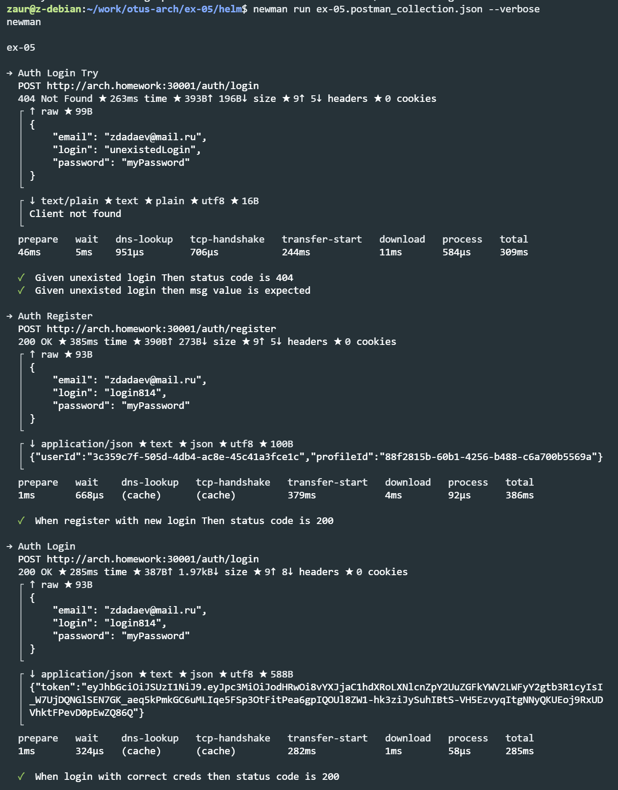
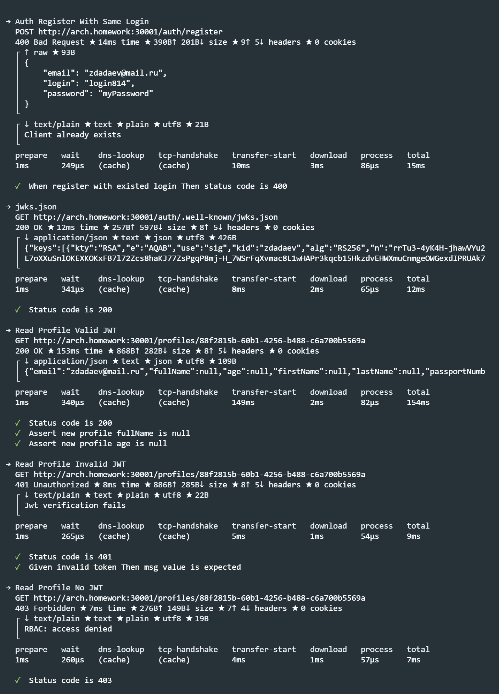
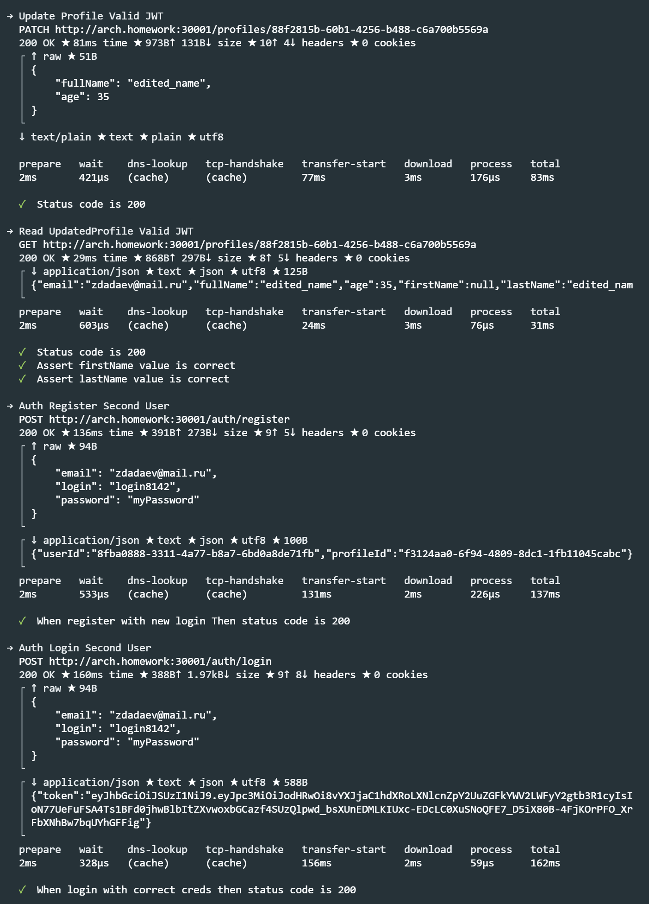
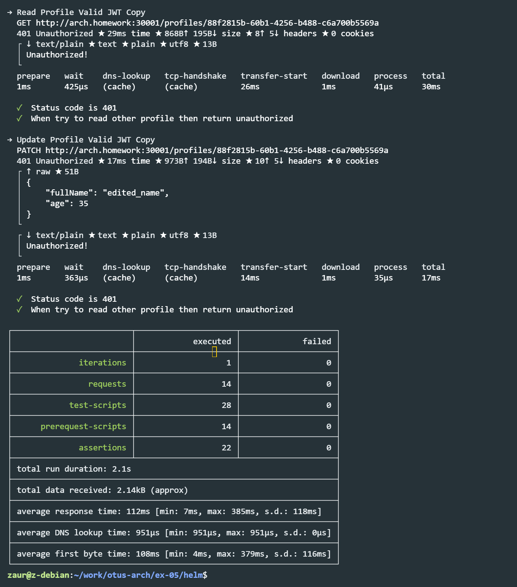

### Домашнее задание №5.

Авторизация реализована через istio по jwt.

### Описание приложения:

Приложение состоит из следующих частей:
- сервер авторизации (СА)
- сервер управления профилями (СУП)
- istio API Gateway c проверкой авторизации по jwt

Запросы на /auth/ не требуют авторизации (перенаправляются на СА), 
остальные запросы требуют передачи валидного jwt (перенаправляются на СУП).

Пользователю доступны API /auth/register, /auth/login, а также API управления Профилем с доступом по токену авторизации.

При первичной регистрации пользователя на /auth/register СА обращается к СУП для создания профиля. 

Полученный profileId привязывается к userId.

После регистрации клиент может залогиниться на /auth/login, в ответ получит подписанный сервисом аутентификации jwt.
Jwt содержит id профиля profileId (из сервиса управления Профилем), созданного при регистрации.

Сервис аутентификации СА имеет пару ключей (хранятся в jks): приватным ключом подписывается jwt; 
публичный ключ открытый, предоставляется по адресу /auth/.well-known/jwks.json

Istio ingressgateway настроен на проверку валидности подписи jwt при помощи публичного ключа. 
При валидном jwt полезные данные из jwt направляются header'ом "x-jwt-token" в микросервис.
При запросе изменения профиля в СУП проверяется profileId из jwt на совпадение с id запрашиваемого профиля. 
В случае попытки запроса чужого профиля запрос считается неавторизованным. 
Верификация и проверка подписи jwt в СУП не производится, за верификацию отвечает Istio.

#### Инструкция по запуску:

- `kubectl create namespace dadaev-arch-otus`
- `helm install ex05-auth auth_deployment/`
- `helm install ex05-profiles profiles_deployment/`
- `istioctl install --set profile=demo -y`
- `istioctl manifest apply -f istio/istio-values.yaml`
- `helm install ex05-istio istio/`

#### Тесты:

newman run ex-05.postman_collection.json --verbose

#### Проверка портов и istio:

- `kubectl get virtualService`
- `kubectl get svc -n istio-system`
  (должен быть порт 30001)

#### Очистка пространства:

```bash
helm uninstall ex05-istio &&
helm uninstall ex05-auth &&
helm uninstall ex05-profiles &&
istioctl uninstall --purge &&
kubectl delete namespace dadaev-arch-otus &&
kubectl delete namespace istio-system &&
```

#### Результаты тестов:




