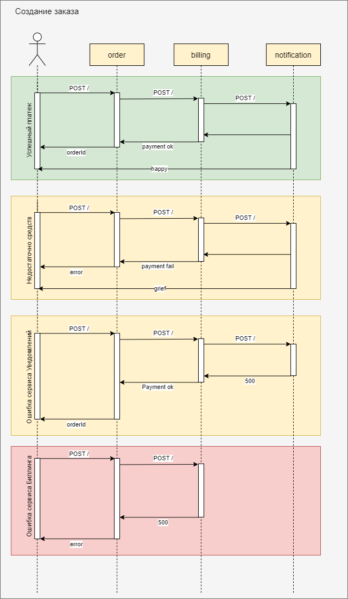
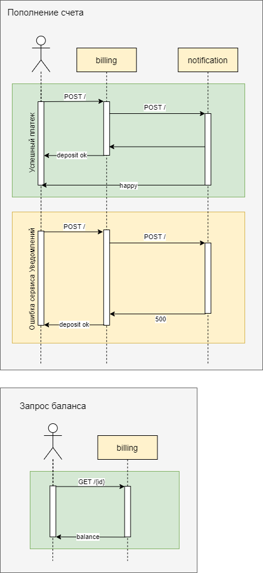
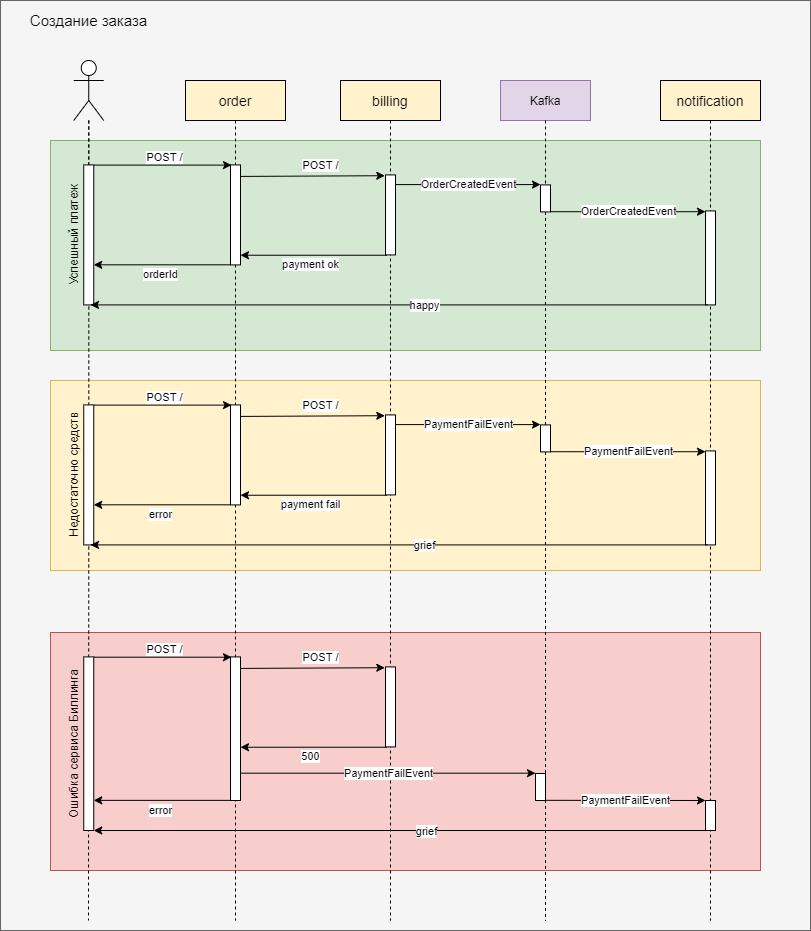
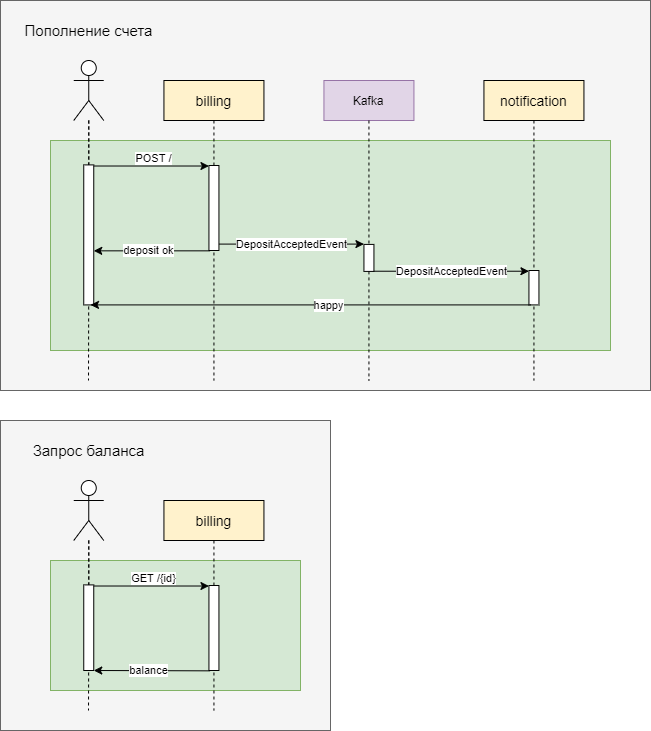
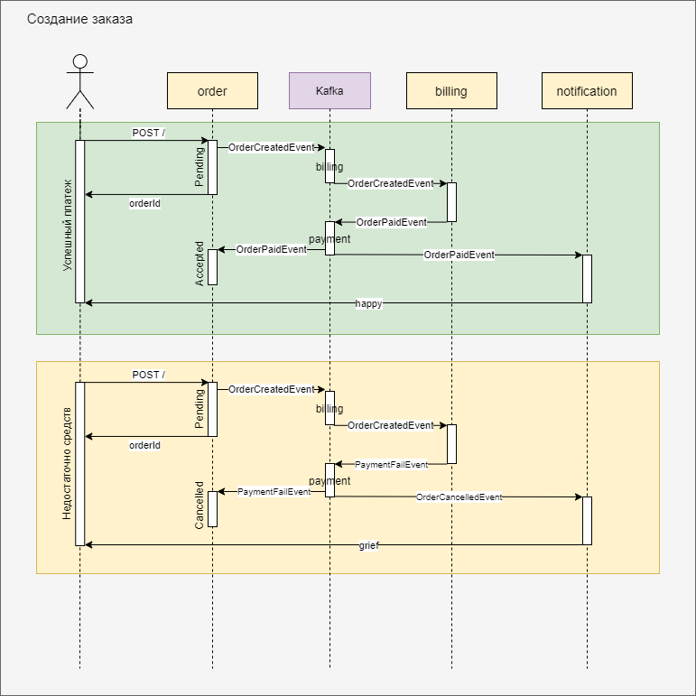
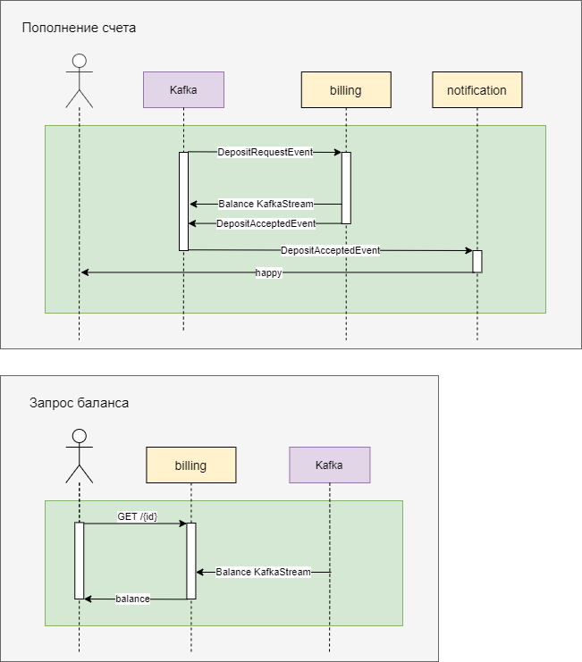
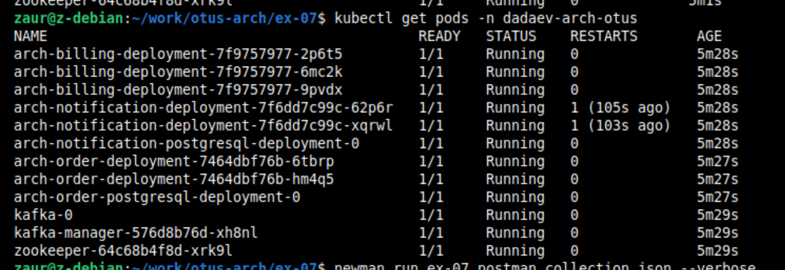

## Домашнее задание №7

Реализовать событийное взаимодействие в микросервисной архитектуре

---

### Описание приложения:
- [Сервис Заказа]
  Пользователь имеет возможность создать заказ. Сервис делает запрос в сервис Биллинга для оплаты заказа.
  
- [Сервис Биллинга]
  Пользователь имеет возможность пополнить счет. Сервис отправляет запрос в сервис Уведомлений для отправки пиcем клиенту.
  Сервис принимает запросы для оплаты созданного заказа.

- [Сервис Уведомлений]
  Сервис принимает запросы для отправки писем клиенту

## Варианты реализации

  ### I. Только HTTP взаимодействие.
  
  
  

  ### II. HTTP взаимодействие для оплаты, отправка уведмолений через брокер сообщений.
  
  
  

  ### III. Межсервисное взаимодействие посредством обмена сообщениями через брокера.
  
  
  
---  

### **Для реализации на практике был выбран вариант III, используя событийное взаимодействие через Kafka.**

- [Сервис Заказа]
  * Пользователь создает заказ посредством HTTP запроса. Сервис отправляет событие в очередь, что заказ создан.
  Заказу присваивается статус PENDING.
  * После проведение платежа в сервисе Биллинга сервис принимает событие об успешной/неуспешной оплате заказа.
  Заказ получает статус APPROVED/CANCELED.
  * Сервис подключен к реляционной БД для хранения данных заказа
  
- [Сервис Биллинга]
  * Сервис **не использует** реляционные БД. Для хранения информации используются KafkaStreams,
  для извлечения информации о состоянии счета - KTable и GlobalKTable.
  * Пополнение счета происходит через очередь сообщений. Чтобы в Postman иметь возможность отправлять сообщения в очередь
  и не запускать отдельный kafka-connector,
  создан коннектор-эндпоинт, принимающий http-запрос. Эндпоинт отправляет сообщение в очередь о внесении депозита.
  * После списания средств сервис отправляет сообщение в очередь об успешной/неуспешной оплате заказа.

- [Сервис Уведомлений]
  * Сервис принимает сообщения об успешной/неуспешной оплате, а также о внесении депозита на счет.
  * Сервис отправляет письма клиенту (в демонстрационных целях сообщения кладутся в БД).
  
---

### Инструкция по запуску:
- `minikube start --vm-driver virtualbox --no-vtx-check`

```bash
kubectl create namespace dadaev-arch-otus &&
helm install dadaev-kafka kafka/ &&
helm install dadaev-arch-billing billing_deployment/ &&
helm install dadaev-arch-notification notification_deployment/ &&
helm install dadaev-arch-order order_deployment/
```

посмотреть все запущенные поды
```bash
kubectl get pods -n dadaev-arch-otus
```

### Тесты:

```bash
newman run ex-07.postman_collection.json --verbose
```

#### Результаты тестов:

Скриншоты с тестами в [папке](./screenshots).

---

### Проверка и отладка:



### Очистка пространства:

```bash
helm uninstall dadaev-arch-billing &&
helm uninstall dadaev-arch-notification &&
helm uninstall dadaev-arch-order &&
helm uninstall dadaev-kafka &&
kubectl delete namespace dadaev-arch-otus
```