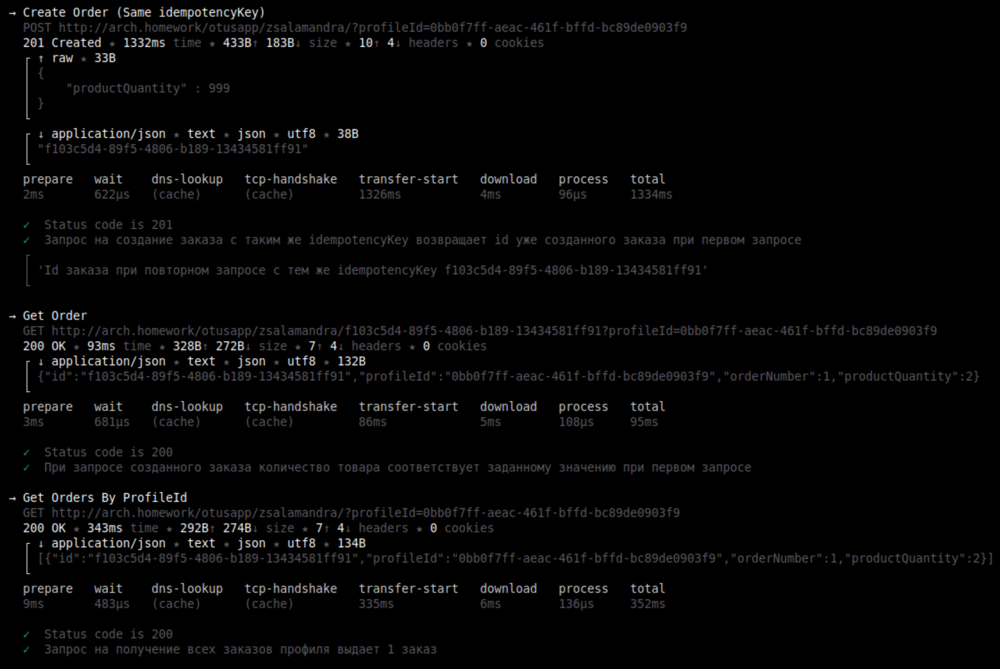

### Домашнее задание №8

Идемпотентость и коммутативность API в HTTP и очередях
Цель:
В этом ДЗ вы создадите сервис "Заказ" (или научитесь использовать сервис из прошлого занятия) и для одного из его методов, например, "создание заказа" сделаете идемпотетным.

Описание/Пошаговая инструкция выполнения домашнего задания:

На выходе должно быть:
описание того, какой паттерн для реализации идемпотентности использовался команда установки приложения (из helm-а или из манифестов). 
Обязательно указать в каком namespace нужно устанавливать и команду создания namespace, если это важно для сервиса.
тесты в postman В тестах обязательно использование домена arch.homework в качестве initial значения {{baseUrl}}
---

#### Описание приложения:
Приложение состоит из:
- Сервис Управления Заказом.
- Реляционная БД PostgreSQL
- Redis для хранения ключей идемпотентности
  

Особенности работы:
- В headers (key: idempotency-key) передается ключ идемпотентности (Ключ). Повторные последующие запросы на
  создание заказа с тем же Ключом возвращают orderId заказа, созданного при первом запросе.
- При получении запроса на создание заказа, проверяется наличие Ключа в Redis БД, 
  если Ключ не найден, то заказ создается в Postgres БД и возвращается уникальный orderId, Ключ сохраняется в Redis.
  Если Ключ найден в Redis, то новый заказ в Postgres не создается, в ответе возвращается orderId уже созданного заказа.
- В Redis хранится Ключ и oderId идентификатор заказа, созданного с помощью этого Ключа. Это позволяет возвращать 
  orderId при повторных запросах с одинаковым Ключом.
- Развернутая в кластере Redis БД служит хранилищем Ключей для всех экземпляров Сервиса Управления Заказом.

---

#### Инструкция по запуску:

```bash
kubectl create namespace dadaev-arch-otus &&
helm install ex08-redis redis/ &&
helm install ex08-arch-order order_deployment/
```

#### Тесты:
```bash
newman run ex-08.postman_collection.json --verbose
```

#### Результаты тестов:





---

#### Очистка пространства:

```bash
helm uninstall ex08-arch-order &&
helm uninstall ex08-redis &&
kubectl delete namespace dadaev-arch-otus
```